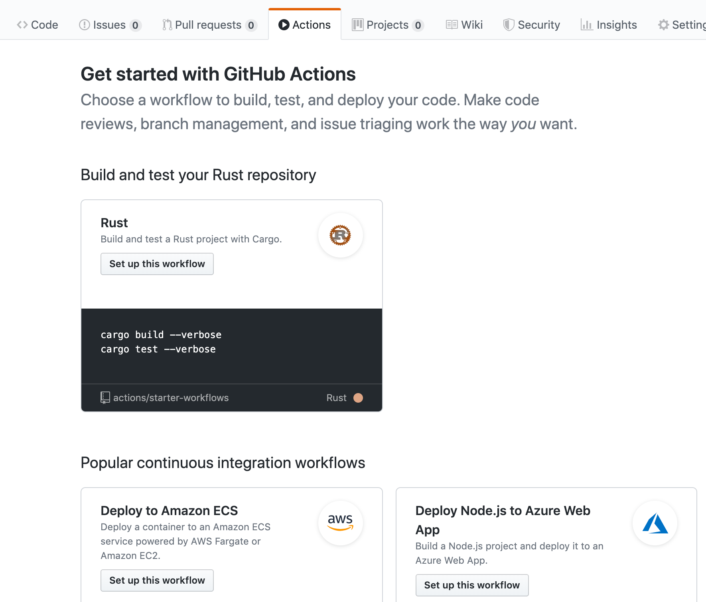

# How to Learn Rust Without Installing Any Software


In this article, we'll learn how to use GitHub Actions to learn Rust from your web browser. We'll code, build, test, run, and release all from a web page. No software needed! [Learn with GitHub](https://github.com/second-state/learn-rust-with-github-actions) or [follow us on Twitter](https://twitter.com/secondstateinc).

Rust is one of the hottest programming languages today. [Alpha geeks](https://martinfowler.com/bliki/AlphaGeek.html) love it. It is Stackoverflow's [most beloved programming language](https://www.theregister.co.uk/2019/04/09/stack_overflow_survey/) for the past 4 years in a row.

One of the most unique and beloved features of Rust is its aggressive compiler that helps you ensure correctness and safety before the program even runs. As a result, Rust developers can write highly performant yet safe programs. Rust eliminates whole classes of programming bugs, especially those hard-to-debug runtime bugs.

If you have not tried it, try it! _It is magical._ I believe Rust could be the next Java or Ruby -- the programming language everyone must learn in the future.

However, learning Rust typically requires you to install a bunch of command line tools on your computer. The Rust compiler is slow because the whole Rust paradigm is set up to deeply analyze the source code and find bugs at compile time, instead of crashing at runtime.

Online Rust IDEs, like the [Rust Playground](https://play.rust-lang.org/) and [REPL.it](https://repl.it/languages/rust), are simple tools that do not take full advantages of the Rust ecosystem of third party compiler targets and libraries.

So you might wonder - can I try and learn Rust without having to install all those software packages on my computer?

Well, with GitHub actions, you can! You can learn and experiment with Rust code directly in your web browser. Let's get started!

> GitHub Actions makes it easy to automate all your software workflows, now with world-class CI/CD. Build, test, and deploy your code right from GitHub. Make code reviews, branch management, and issue triaging work the way you want. The source code and workflow actions for the Hello World example can be found in [this GitHub repository](https://github.com/second-state/learn-rust-with-github-actions).

### Hello world <a id="hello-world"></a>

First, create a new GitHub repository, and add a Rust source file. Let's add a `src/main.rs` file with the following content.

```text
fn main() {
    println!("Hello, world!");
}
```


Next, go back to the root `/` directory of the GitHub repository, and add a `Cargo.toml` file. This file describes how the Rust cargo system should build and package our project.

```text
[package]
name = "hello"
version = "0.1.0"
authors = ["ubuntu"]
edition = "2018"

[dependencies]
```

The Cargo.toml file at the root directory of the repository

Now we have a complete Rust project. Let's build and run it now.

### Github actions <a id="github-actions"></a>

On GitHub's Actions tab, we can add workflows associated with this project. Those are actions Github automatically performs when certain events occur, such as code push or commit. In our case, we would like GitHub to automatically build and run our `main.rs`, and show us the results.

The workflow actions and their event triggers are defined in `yml` files under the `.github/workflows` directory. You can write your own `yml` files, or pick from one of the ready-made templates.



Here we choose the Rust template. GitHub allows you to edit the `rust.yml` file before checking it into the repository.


Let's take a minute here to explain how GitHub Actions work. The default `rust.yml` file says that

* Whenever a user pushes code or accepts pull requests into this repository, the actions in this `rust.yml` workflow will be triggered.
* The workflow will create a virtual machine running the latest Ubuntu operating system. On this Ubuntu system, it will then perform the following steps.
* It will checkout the code from the `master` branch.
* It will run the `cargo build --verbose` command to compile and build the Rust code.
* It will run the `cargo test --verbose` command to execute the test cases.
* All the standard and console outputs on the Ubuntu system from the above two commands will be captured by GitHub Actions and displayed on the web.

You can edit the last line in `rust.yml` to perform `cargo run`, which runs the compiled binary program. Our updated `rust.yml` file is as follows.

```text
name: Rust

on:
  push:
    branches: [ master ]
  pull_request:
    branches: [ master ]

jobs:
  build:

    runs-on: ubuntu-latest

    steps:
    - uses: actions/checkout@v2
    - name: Build
      run: cargo build --verbose
    - name: Run
      run: cargo run
```

We changed the last line of the default Rust template to cargo run

Now whenever you push code to this repository, the actions in `rust.yml` are performed. You can see the results under the Actions tab.


You can click on a result, and click on the build tab to the left to see the details. The build and run sections provide the most relevant details. The Run section shows successful printing of hello world!


Next, you can add third party dependencies in `Cargo.toml`, and build complex Rust applications in main.rs. Every time someone pushes code, we will be able to see the results.

### Test Driven Development \(TDD\) <a id="test-driven-development-tdd-"></a>

Of course, very few developers actually run their programs to print text to the console. The `cargo run` above is just a show. In reality, most developers write functions and test cases for those functions. The most frequent task after compiling and building is to run test cases. Let's see how it is done.

Create a new GitHub repository, and then add a `src/lib.rs` file below. As you can see, it defines a Rust function and a few test cases. It can be built and released as a Rust library package.

```text
pub fn say(s: &str) -> String {
  let r = String::from("hello ");
  return r + s;
}

#[cfg(test)]
mod tests {
  use super::*;
  
  #[test]
  fn say_hello() {
    let result = say("ssvm");
    assert!(result.contains("hello ssvm"));
  }
}
```

Then, go back to the root `/` directory of the GitHub repository, and add the following `Cargo.toml` file.

```text
[package]
name = "hello"
version = "0.1.0"
authors = ["ubuntu"]
edition = "2018"

[lib]
name = "hello_lib"
path = "src/lib.rs"
crate-type =["cdylib"]

[dependencies]
```

Click on the Actions tab and add the default Rust workflow. As you recall, the default Rust workflow ends with `cargo test`, which is exactly what we need here.


The workflow runs every time new code is pushed into this repository. You can click open a successful build, and see the output from the build and test actions.


### What's next <a id="what-s-next"></a>

Now you can experiment with your Rust code, and have GitHub build, test, and run it for you with complete console outputs, for free and without ever leaving your browser!

### Resources <a id="resources"></a>

* [Learn to program in Rust](https://www.rust-lang.org/learn)
* [Learn more about GitHub Actions](https://github.com/features/actions)
* Of course, the best way to run Rust programs on the server is [inside a WebAssembly Virtual Machine](https://docs.secondstate.io/beginners-guide-to-webassembly/my-first-webassembly-app). Checkout the open source [Second State VM](https://www.secondstate.io/) for that!
* Learn about the [BUIDL](https://www.secondstate.io/buidl/) online IDE to [code and deploy](http://buidl.secondstate.io/) decentralized web apps on public blockchains

